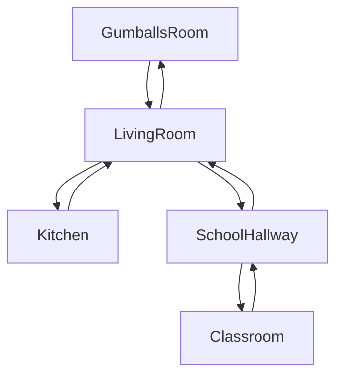

# The Missing Homework

## Setting
The setting starts at Gumball's house. The player navigates throughout his house to find pages and interact with his family and friends to find his essay pages. He can also enter school for the pages before he MUST go to Ms. Simian's classroom and turn in his work (completed or not).

## Map

## Story
Ms. Simian assigned a 3 page essay that Gumball didn't want to do so he convinced his sister to write it for him. On the day the paper was due, Gumball finds out that it's missing from his backpack! He must find all of the pages before the period creeps up on him.

## Global Variables
The only global variable would be `pages` counting the amount he finds. The amount of pages would determine the ending Gumball would be in!
