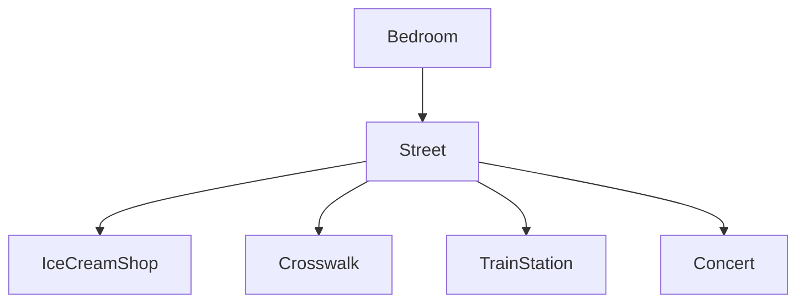

# Dazey Day

## Setting
Players start off in their apartment and eventually make their way through
their day to wake up and get ready for their concert they are performing!
Getting throug their day, they take a relaxing walk through the neighborhood, 
get ice cream, and come back. Eventually, the players will make it to
their concert.

## Map

## Story
The user is a musician that suddenly woke from their sleep at 12:00 AM on
August 15th. They remember that today is their concert! They get ready for
their concert doing things such as taking a walk and getting ice cream to 
calm their nerves. A cute cat catches their eye and tries to pet it. 
It runs away but you pay no mind, until a truck goes in your direction. 
They think they're done for when they woke up right back at their desk at
12:00 AM on August 15th again.
this mistake would cause a series of events that the user would have to
navigate to get to their concert on time (and in one piece)!

## Global Variables

An important variable in the game would be `recollection`.
The variable starts at 0 at the start of the game, but with each series
of events that ends the value will go up by one. Each value of `recollection`
triggers a different choice for each series of events you encounter again.

Some more niche variables would be `takeWalk`, `iceCream`,`kitty`, and more
WiP. I will update as I go and actually code my game "(~_~
