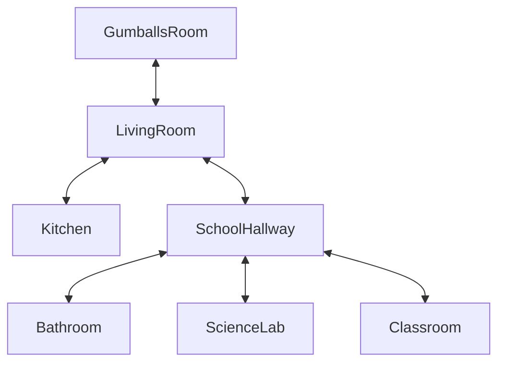

# The Final Pages

## Setting
The setting starts at Gumball's house. The player navigates throughout his house to find pages and interact with his family and friends to find his essay pages. He can also enter school for the pages (yes they are that scattered).

## Map

## Story
Ms. Simian assigned a 3 page essay that Gumball didn't want to do so he convinced his sister to write it for him. On the day the paper was due, Gumball finds out that it's missing from his backpack! He must find all of the pages at home and at school before the period creeps up on him.

## Global Variables
The global variable would be:
`pages` counting the amount he finds. The amount of pages would determine the ending Gumball would be in!
`position` to keep track of the location of some places to accurately change descriptions when entering places. For example, going from the school to Gumball's house to not say "sliding down the stairs" when going from his bedroom to living room and instead simply saying he went to the living room.

The following is to keep track of a side quest Gumball encounters in the bathroom to access the last page.
`hasKey`
`hasGum`
`metTobias`

The following is to prevent repetitive dialog as well as prevent the code from giving the same pages Gumball found.
`visitedroom`
`visitedCouch`
`visitedFridge`
`visitedLab`
